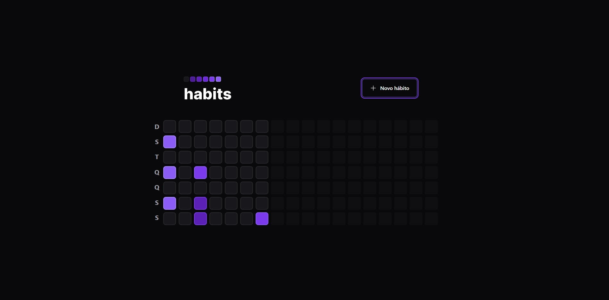
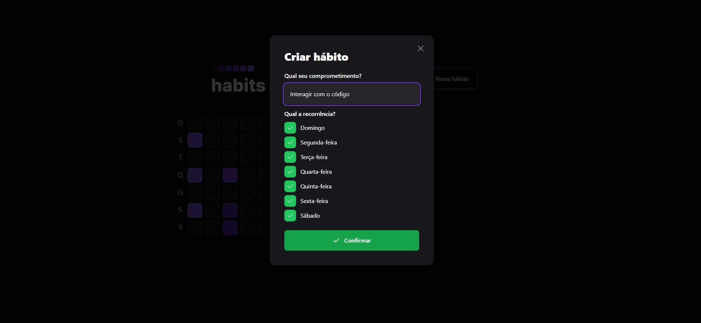
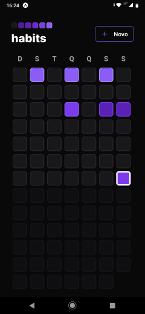
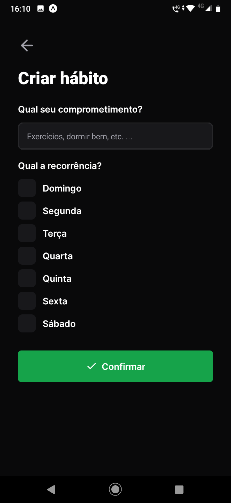
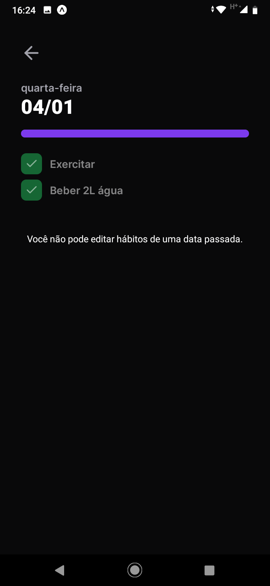
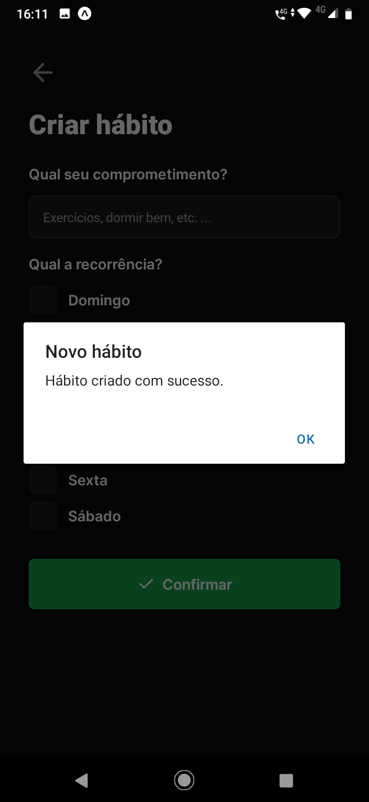

<h1 align="center"> Habits </h1>

  

<h3 align="center">
Você no controle da sua rotina!
</h3>

O programa tem o intuito de monitorar os compromissos assumidos pelo próprio usuário na tentativa de fazê-lo seguir uma rotina 
pré estabelecida.

Uma caixa de verificação na tela inicial tem uma cor que indica o progesso do cumprimento das atividades daquele dia.
0% sem cor, até o (roxo claro) que indica que todas atividades foram completadas.

## Telas 

  <b>Aplicação WEB</b>
   
    
    

A rotina é criada e os dias que deverão ser cumpridos, são definidos na ocasião da criação.

  <b>Aplicação Mobile</b>
   
    
    
    
    

A lista de hábitos é cumulativa.
Caso o usuário insira um novo hábito em um dia qualquer, à partir daquele dia, na lista de hábitos conterá este último hábito cadastrado, além dos hábitos já cadastrados.

